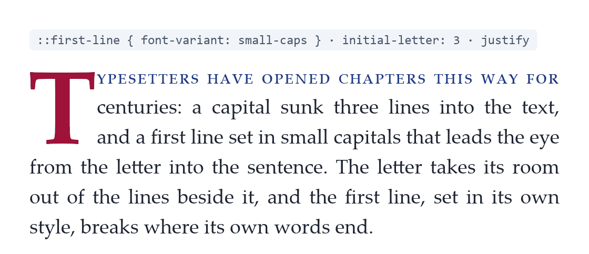
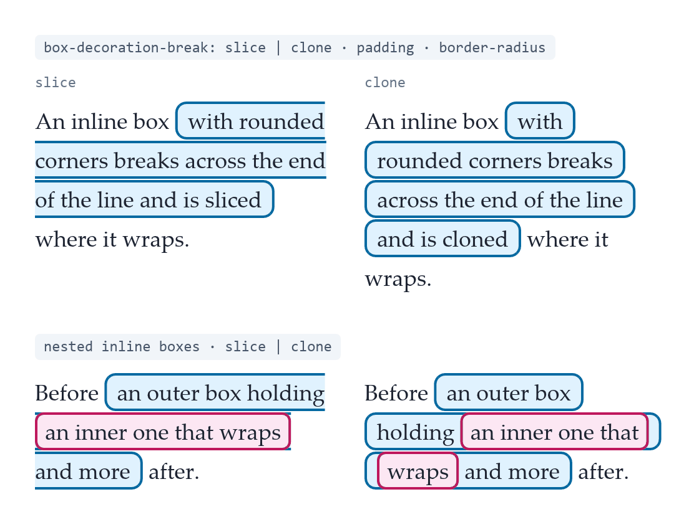
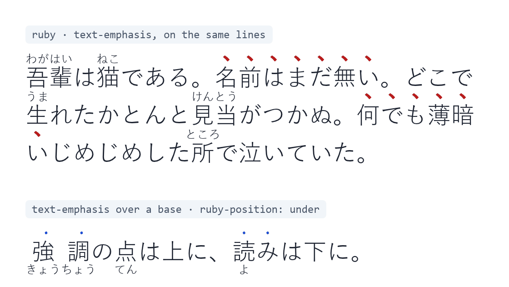
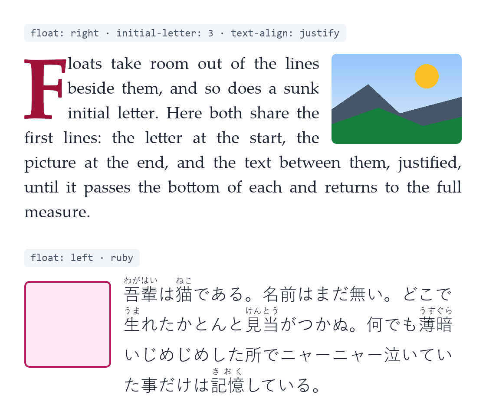
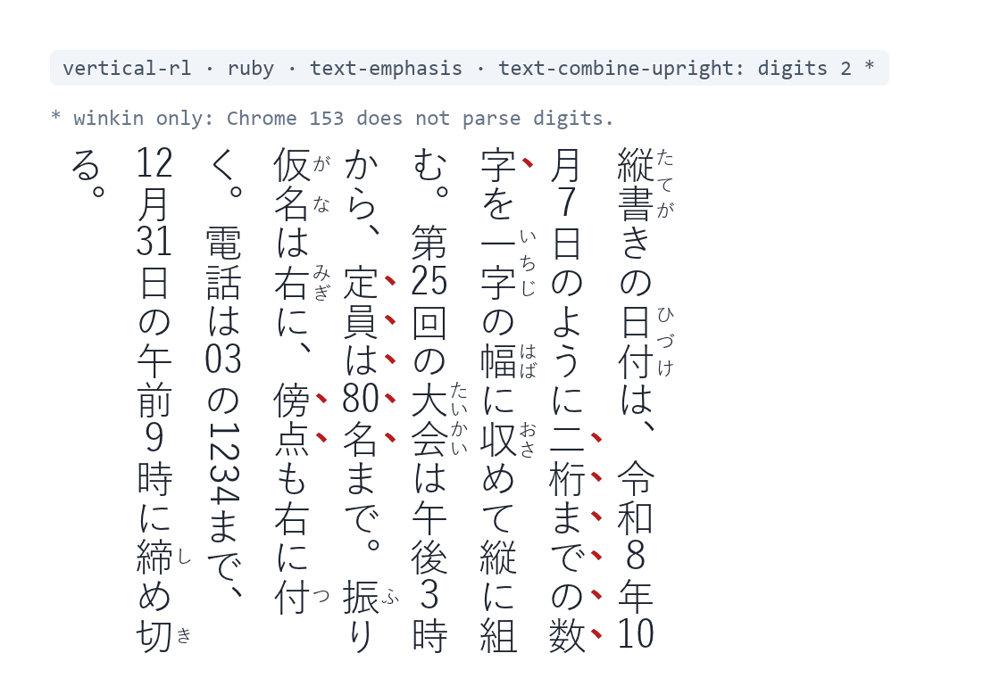

# Showcase

Each image mixes several CSS features in one specimen. winkin laid out the
text inside the Blitz browser engine, with the fonts that come with
Windows 11 (Palatino Linotype, Yu Gothic and Consolas), and Blitz painted
it. The images are 560 CSS px wide at a device pixel ratio of 2. The small
grey tag above each specimen names the features it uses.

## First line and initial letter

A capital sunk three lines deep opens a justified paragraph whose first line
is set in small capitals. The first line is shaped in its own style before
the paragraph breaks, and the letter takes its room out of the lines beside
it.

## Inline boxes across lines

Rounded, padded and bordered inline boxes break across lines. With
`box-decoration-break: slice` the box is cut open where it wraps; with
`clone` each line gets its own padding, border and rounded corners. The
lower pair nests one box inside another.

## Ruby and emphasis marks

Japanese text carries ruby readings and sesame emphasis marks over the same
lines, and the lines make room above for both. Below, emphasis dots
sit over a base whose ruby is placed under it with `ruby-position: under`.

## Floats

A picture floats right while a three-line initial letter sinks at the start
of the same lines, and the justified text runs between them. Below, Japanese
text with ruby flows beside a float on the left.

## Vertical text

Japanese set in `vertical-rl`, with ruby on the right of the lines and
emphasis marks beside them. `text-combine-upright: digits 2` sets runs of
up to two digits upright within one em, as in dates and times, and leaves
the four-digit number on its side. Chrome does not support the `digits`
value.

